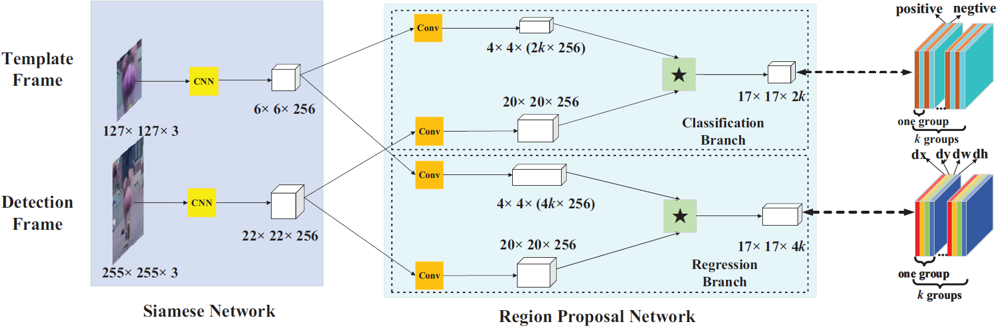

# SiamRPN-PyTorch
Re-implementation of the SiamRPN for object tracking applications using the PyTorch framework.

Developed code was based on the following previous implementations: [SiamRPN-Pytorch](https://github.com/arbitularov/SiamRPN-PyTorch) and [SiamRPN-Pytorch](https://github.com/songdejia/Siamese-RPN-pytorch)

<p align="center"></p>

## Performing
To test the developed code, the VOT-2013 Gymnastics sub-dataset was used:


### Requirements

    Python >= 3.6
    PyTorch >= 1.0.1
    torchvision
    cv2
    tqmd
    
### Training & Tracking
Implemented code receives the ground-thruth under the form of `[x1, y1, w, h]`.

Dataset tree:

    dataset_path/Gymnastics/img1.jpg
                           /img2.jpg
                           /...
                           /imgN.jpg
                           /groud_truth.txt

To train:

    $ python3 SiamRPN_train.py --train_path=\your_dataset_path

To track

    $ python3 SiamRPN_tracker.py --track_path=\your_dataset_path

## Citation

```
@InProceedings{Li_2018_CVPR,
author = {Li, Bo and Yan, Junjie and Wu, Wei and Zhu, Zheng and Hu, Xiaolin},
title = {High Performance Visual Tracking With Siamese Region Proposal Network},
booktitle = {The IEEE Conference on Computer Vision and Pattern Recognition (CVPR)},
month = {June},
year = {2018}}
```


## Contacts
ricardo.pereira@isr.uc.pt
